```{r setup, include=FALSE, echo=FALSE}
knitr::opts_chunk$set(echo = TRUE)
```

```{r load libraries, warning=FALSE, message=FALSE, echo=FALSE}
r = getOption("repos")
r["CRAN"] = "http://cran.us.r-project.org"
options(repos = r)
library(tm)
library(tidytext)
library(tidyverse)
library(DT)
library(ngram)
library(topicmodels)
library(LDAvis)
library(servr)
library(dplyr)
library(stringi) 
```


Do you feel happy today? Do you recall what makes you happy today? We all enjoy happy moments in our lives, but sometimes even ourselves don't understand what can make us happy. Here, I conduct an analysis on the causes of happiness using [HappyDB](https://arxiv.org/abs/1801.07746), a collection of happy moments described by individuals experiencing those moments.

### What are the most happiest moments people experiencing?

In this part, I analyzed the most frequent bigrams appeard in individuals' descriptions of happy moments. Then, I divided those descriptions based on their individual's gender, marital status, parenthood, nationality, and the reflection period of those descriptions. 

Female vs. Male
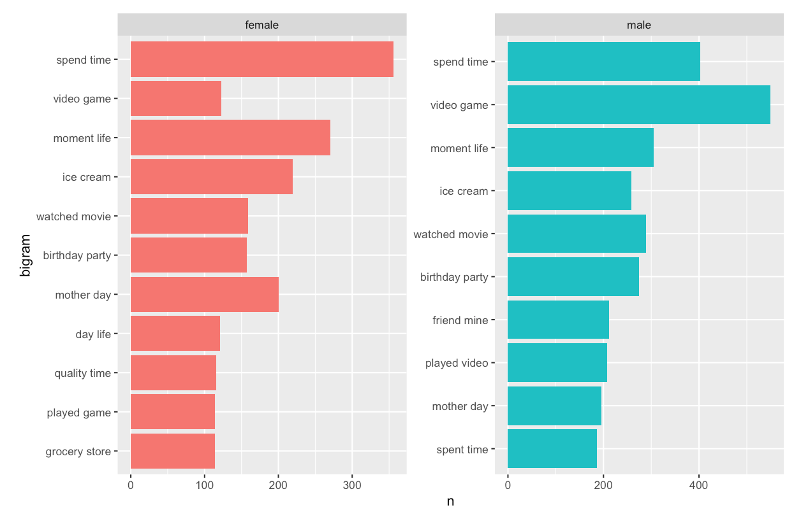 
Married vs. Single
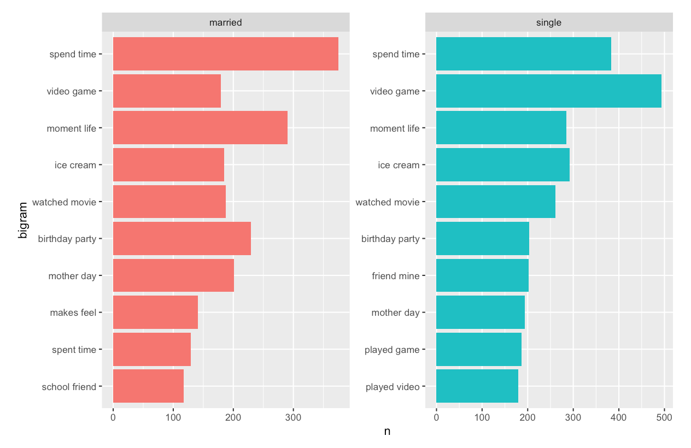 
No-Child vs. Have-Child
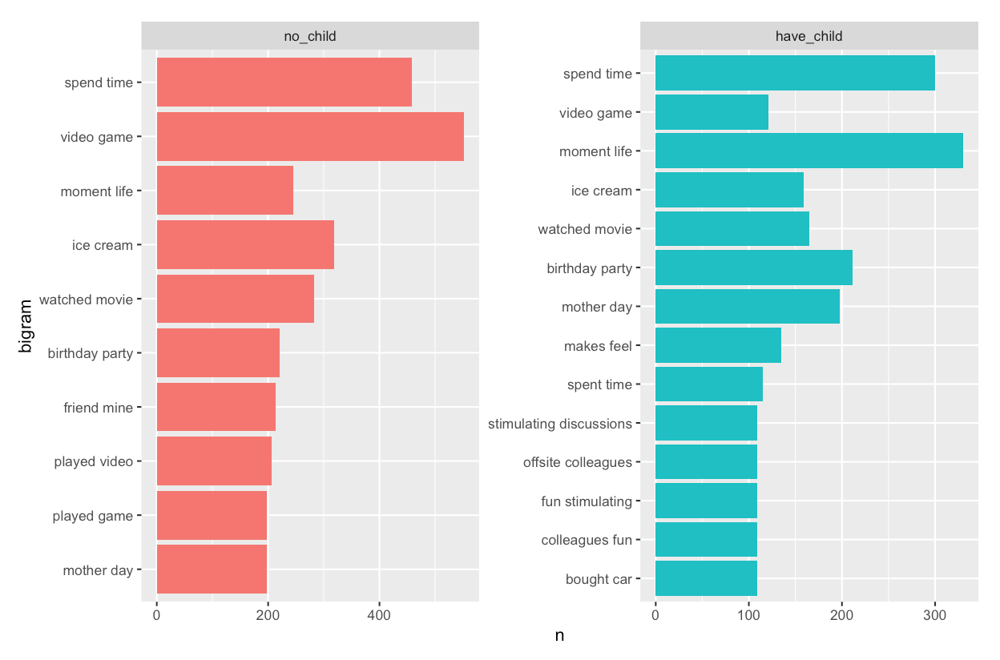 
INA vs. USA
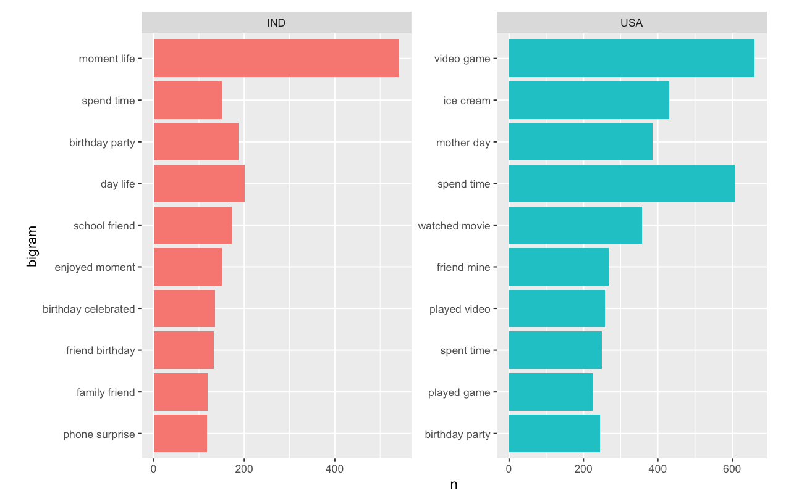

It can be seen from the above charts that the main difference between gender is that males tend to enjoy video games, and females tend to be happier when spending time with others. Additionally, it also shows that single individuals or individuals who do not have a child tend to enjoy video games. 
From the chart that compares individuals from different countries (USA and IND), we can see a significant difference. So we further explore the most frequent words appeared in the descriptions of happy moments from these two countries:

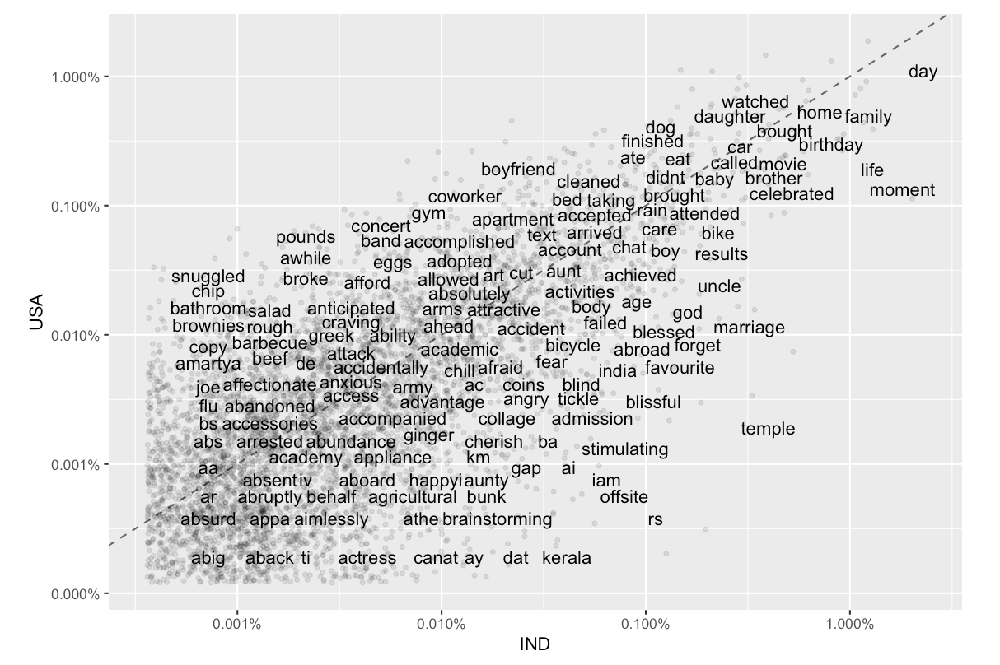

We can see that Americans tend to enjoy "gym", "boyfriend", "dog", "concert", etc., while Indians enjoy "kerala", "temple" more than Americans. This shows cultural difference can lead to different causes of happy moments.

### What are the most frequent categories of these happy moments?

In this part, since each description of happy moments has a predicted category (affection, achievement, etc.), I tried to analyze how different factors affact the categories of those happy moments.


We can see from the above chart that affection and achievement are two main categories of happy moments. Further, there are some comparisons between different individual groups.

Male vs. Female
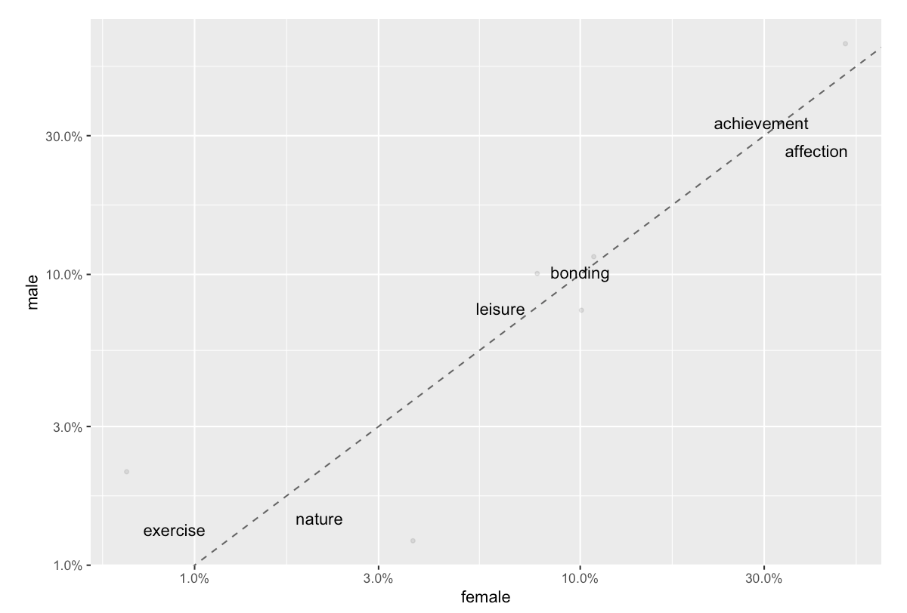 
Single vs. Married
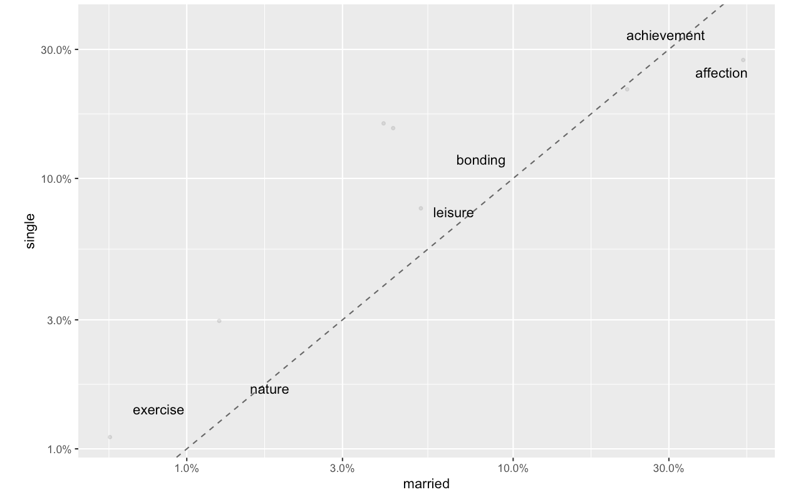 
Have-Child vs. No-Child
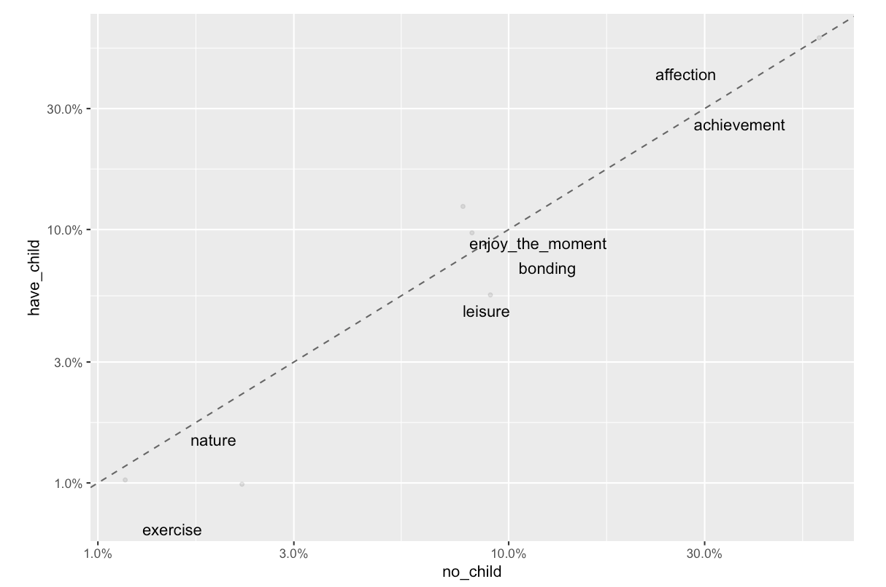 
USA vs. IND
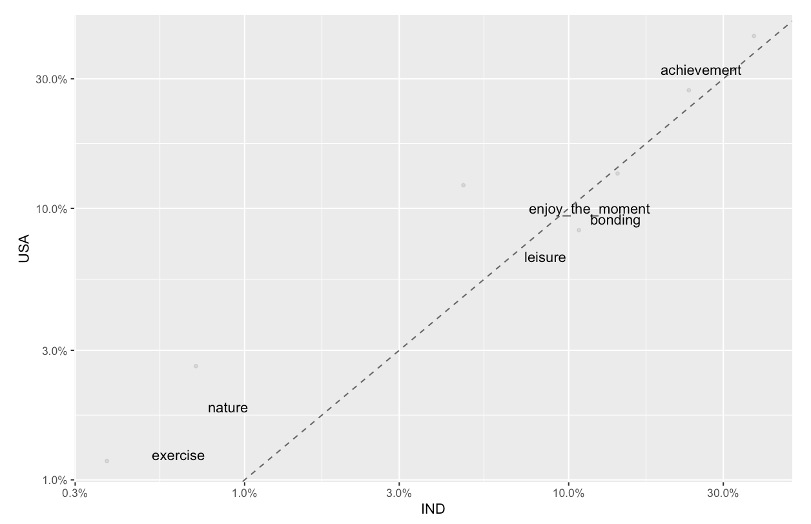 
3-months vs. 24-hours
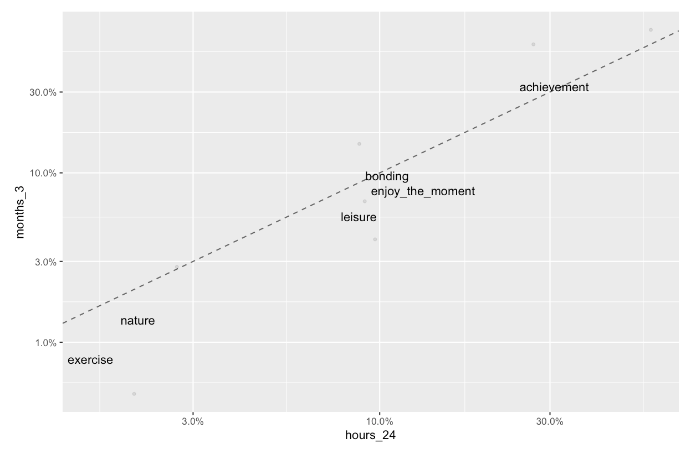

We can see that males prefer exercise while females prefer affection and nature, married individuals and individuals with children prefer affection, bonding and achievement can produce more long-time happiness as shown in the reflection period of 3 months, and Indians enjoy bonding more than Americans.

### What are the keywords for happy moments?

In this part, I created a word cloud to show the top 100 words in the descriptions of happy moments.

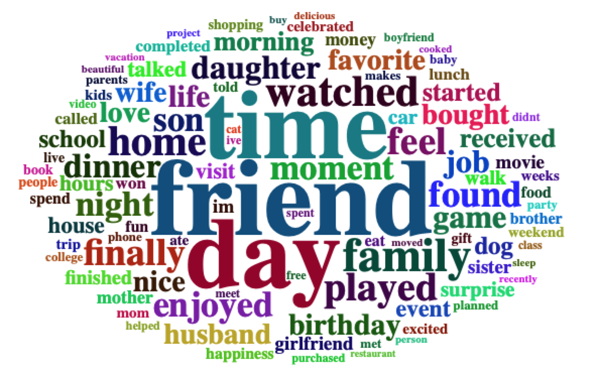

Words from this cloud would give us a sense about the causes of happy moments.

### Topic Modeling

In the last part, I used Topic Modeling to generate 10 topics from these happy moments to further explore the causes. The top terms of these 10 topics imply some causes of happy moments, for example, spending time with friends or family, some special day or moment, a good moring/day/night, leisure, achievement at work, etc.

```{r load data, warning=FALSE, message=FALSE, echo=FALSE}
hm_data <- read_csv("../output/processed_moments.csv")
hm_data <- hm_data[0:10000,]
```

```{r, echo=FALSE}
# Aggregate
hm_byusers <- aggregate(x = hm_data$cleaned_hm, by = list(hm_data$wid), paste, collapse=". ")
colnames(hm_byusers) <- c("wid", "cleaned_hm")

# Convert the text into a corpus
hm_byusers_corpus <- iconv(hm_byusers$cleaned_hm)
corpus <- Corpus(VectorSource(hm_byusers_corpus))

# Text cleaning
corpus <- tm_map(corpus, content_transformer(tolower)) 
corpus <- tm_map(corpus, removePunctuation) 
corpus <- tm_map(corpus, removeWords,stopwords("english")) 
corpus <- tm_map(corpus, removeWords,c("happy","ago","yesterday","lot","today","months","month","happier","happiest","last","week","past")) 
corpus <- tm_map(corpus, removeNumbers) 
corpus <- tm_map(corpus, stripWhitespace) 

# Construct a document-term matrix (DTM)
dtm <- DocumentTermMatrix(corpus)
```

```{r, echo=FALSE}
# Topic Modeling
burnin <- 4000
iter <- 2000
thin <- 500
seed <-list(2003,5,63,100001,765)
nstart <- 5
best <- TRUE

k <- 10 #find 10 topics

ldaOut <-LDA(dtm, k, method="Gibbs", control=list(nstart=nstart, seed = seed, best=best, burnin = burnin, iter = iter, thin=thin))

topicmodels2LDAvis <- function(x, ...){
  post <- topicmodels::posterior(x)
  if (ncol(post[["topics"]]) < 3) stop("The model must contain > 2 topics")
  mat <- x@wordassignments
  LDAvis::createJSON(
    phi = post[["terms"]], 
    theta = post[["topics"]],
    vocab = colnames(post[["terms"]]),
    doc.length = slam::row_sums(mat, na.rm = TRUE),
    term.frequency = slam::col_sums(mat, na.rm = TRUE)
  )
}

serVis(topicmodels2LDAvis(ldaOut))
```


### Summary
In summary, I found that individuals mainly share a common cause for happy moments, like friends, family, leisure and achievement. While on the other hand, there are some variations of causes when comparing individuals from different group. Individuals with different gender, marital status, parenthood and nationality may have different flavor to gain happiness. Also, happiness from bonding and achieve might last longer as people would still recall those happiness three months later.

### Reference

1. Topic Modeling: https://rpubs.com/cosmopolitanvan/topicmodeling